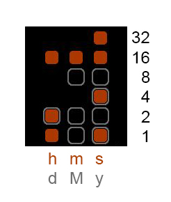

# PebbleAlphaBinary
Binary Watchface for Pebble

The picture above shows the watchface of the Alpha Binary Clock. The orange dots display the time, the grey borders the date.
The time can be simply calculated by summing up their values, which are here written on the right next to the picture.

The following explanation shows how to calculate the time and date for the moment shown in the image

###Time

Hour (h): 1 + 2 + 16 = 19

Minute (m): 16 = 16

Seconds (s): 1 + 4 + 16 + 32 = 53

=> 19:16:53

###Date

Day (d): 2 = 2

Month (M): 1 + 2 + 8 = 11

Year (y): 1 + 2 + 3 + 4 = 15

=> 2.11.(20)15 (Year is shown with modulo 50)

###Easy code customization

If you want change for example the color of the dots or want to have them as circles, that can be easily customized in the start of the code along other options:

BACKGROUND_DARK true //true: black background; false: white background

FILL_COLOR GColorOrange //the fill color of a cell; only if colors are possible, else inverted to background

BORDER_COLOR GColorLightGray //the border color of a cell

RELATIVE_CORNER_RADIUS 0.5 //border radius in ralation to half of the cell's dimension [0.0 -> rect; 1.0 -> circle]

BORDER_WIDTH 2 //border width in pixels

BORDER_PADDING 1 //border padding to cell in pixels

VERTICAL_SPACE 3 //the vertical space between two cells in pixels

HORIZONTAL_SPACE 10 //the horizontal space between two cells in pixels

HAS_BORDER true //defines if a border is drawn around a single cell (overritten by activated IS_BORDER_DATE)

IS_BORDER_DATE true //defines if the border represents the current date (if activated overrides HAS_BORDER)
 

